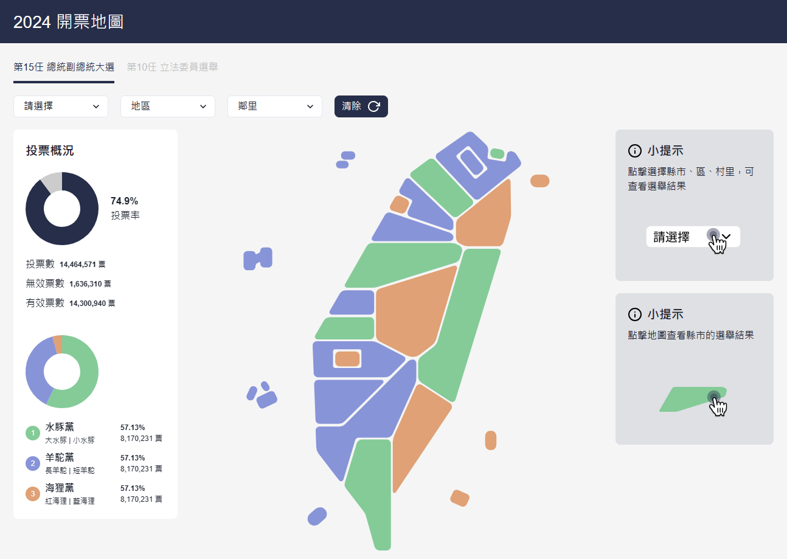

# 2023 THE F2E Mission 2 總統即時開票全台地圖



[DEMO](https://joy-chang-2021.github.io/2023HexSchool02_ElectionMap/)

### 專案介紹
此為六角學院 2023 年 THE F2E 精神時光屋活動，主題二：總統即時開票全台地圖
- 活動官網：[https://2023.thef2e.com/](https://2023.thef2e.com/)
- UI設計個人組：[Yuni](https://2023.thef2e.com/users/12061579704055397263)
- 前端個人組：JoyChang/[Family](https://2023.thef2e.com/users/12061579704044466133)

### 專案結構
```shell
├── public/           # 靜態資源
├── src/              # 主要程式碼
│   ├── assets/       # 被編譯的靜態資源
│   │   ├── datalist/ # 地圖資料
│   │   ├── icons/    # 圖符檔
│   ├── components/   # 元件
│   │   ├── context/  # 全域共用資料
│   │   ├── theme/    # 全域樣式設定檔
│   ├── App.js        # 專案進入點
│   ├── index.js      # 入口文件
└── package.json      # 專案資訊、指令、套件及版本號
```

### 專案工具
- React
- Chakra-ui
- Styled-Components
- chart.js, react-chartjs-2
- gh-pages

### 開發指令
```bash
# 安裝專案
git clone https://github.com/Joy-Chang-2021/2023HexSchool02_ElectionMap.git
# 安裝相關套件
npm instal
# 啟動專案
npm run start
```

### 其他
##### 目前完成功能
- 點擊城市下拉選單，地圖上同地點黑框聚焦
- 點擊地圖，下拉選單切換為指定城市
- 點擊「清除」鍵可清除城市聚焦狀態
- 地圖上各縣市可根據資料呈現不同顏色
- 鼠標經過地圖上可顯示城市名稱

##### 待開發或研究功能
- 整理城市、地區、鄰里三種資料，模擬讀取資料的流程
- 城市、地區、鄰里三種資料的畫面渲染
- 待多嘗試研究 chart.js 功能設定